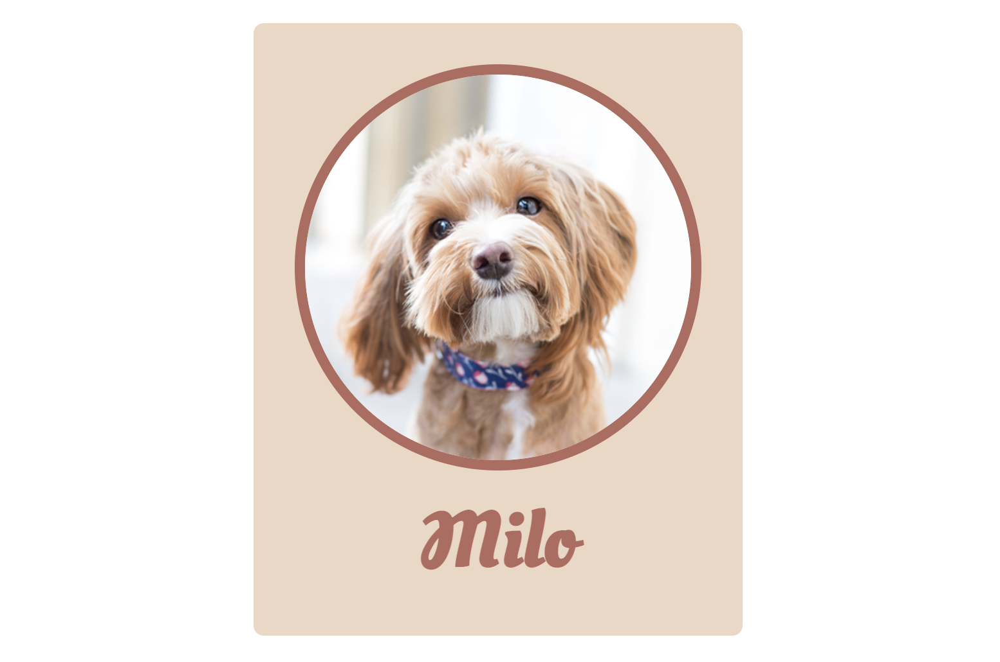

# Opdrachtbeschrijving

## Eindresultaat
Je bent er klaar voor om de kracht van The Box model in de praktijk te gaan brengen. Je gaat een huisdier-badge maken die er zo uit zal komen te zien:

Je kunt deze opdracht maken door het project te clonen of te downloaden naar jouw eigen computer via [deze](https://github.com/hogeschoolnovi/frontend-css-pet-badge) GitHub repository. De uitwerkingen staan op de branch *uitwerkingen*. Wanneer je liever handmatig een eigen project opzet, mag dit ook. Zorg dan dat je [deze](https://github.com/hogeschoolnovi/frontend-css-pet-badge/blob/master/index.html) HTML in jouw HTML-bestand plaatst én de afbeelding handmatig in jouw project opslaat.

Het project bevat de volgende bestanden:

- `index.html` met daarin de tekst en elementen die je zult gaan voorzien van styling;
- `styles.css`: dit bestand is nog leeg.

## Aandachtspunten

Zorg ervoor dat jouw versie er precies zo uit komt te zien als de pagina in het voorbeeld. Je mag niets veranderen in de aangeleverde HTML, behalve het toevoegen van `class` of `id`-attributen. Volg hiervoor de volgende stappen:

1. Geef het article-element een `display: inline-block;` om te voorkomen dat dit element over de volledige breedte van de pagina strekt.
2. Wijs de juiste kleuren toe aan de elementen. Er is gebruik gemaakt van de kleuren `#B36A5E` (tekst- en randkleur), `#EED7C5` (badge-kleur).
3. De rand van de afbeelding moet 8 pixels breed zijn, de afbeelding zelf mag 300 pixels breed zijn. Tip: wanneer je een breedte declareert, wil je bij afbeeldingen niet óók nog eens een hoogte toewijzen. Dit gebeurt al automatisch. Wanneer je dit wel doet, heb je kans dat je de afbeelding onbedoelt uitrekt.
4. Zorg dat de afbeelding wordt weergegeven als cirkel. Zorg ook dat er ongeveer 10 pixels aan ruimte tussen de afbeelding en de titel komt te staan, door alleen `margin` aan de onderkant van de afbeelding toe te passen.
5. Zorg dat er 32 pixels aan ruimte ontstaat tussen de denkbeeldige rand van het article-element en alle elementen daarbinnen. Tip: gebruik hier `padding` voor. 
6. Zorg voor een mooie shaduw achter het article-element.
7. Het gebruikte lettertype is het Google Font 'Oleo Script Swash Caps'. Dit lettertype krijgt van nature bijna 50 pixels aan `margin` mee: dat vinden we veel te veel. Overschrijf dit naar 0.
